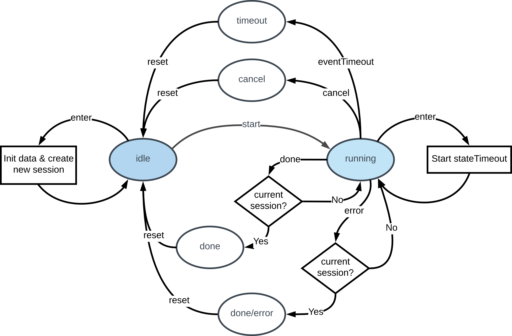

# Vue Flickr App

Online demo [here](https://vue-flickr-app.netlify.com/#/)

See [article](https://medium.com/@venkatperi/run-your-javascript-tasks-like-a-pro-31f6e41ed851).

A typical use case for the Task class with a VueJs single page app that fetches data from the Flickr API and displays it.

